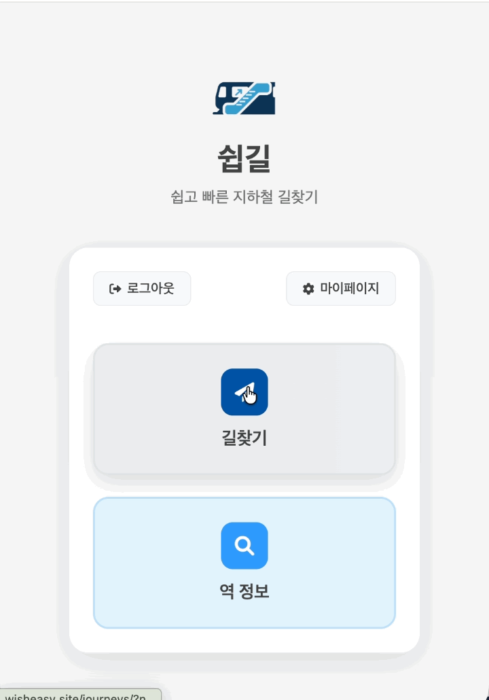
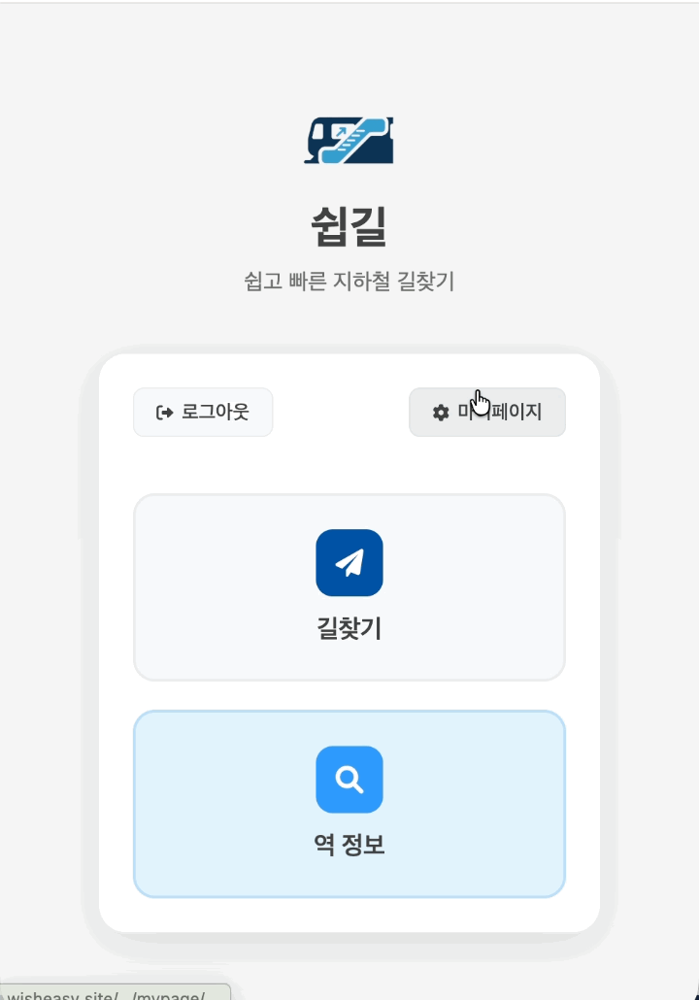
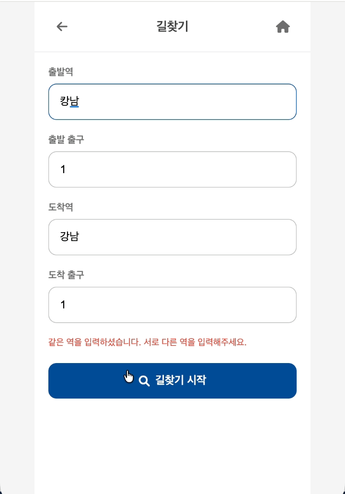
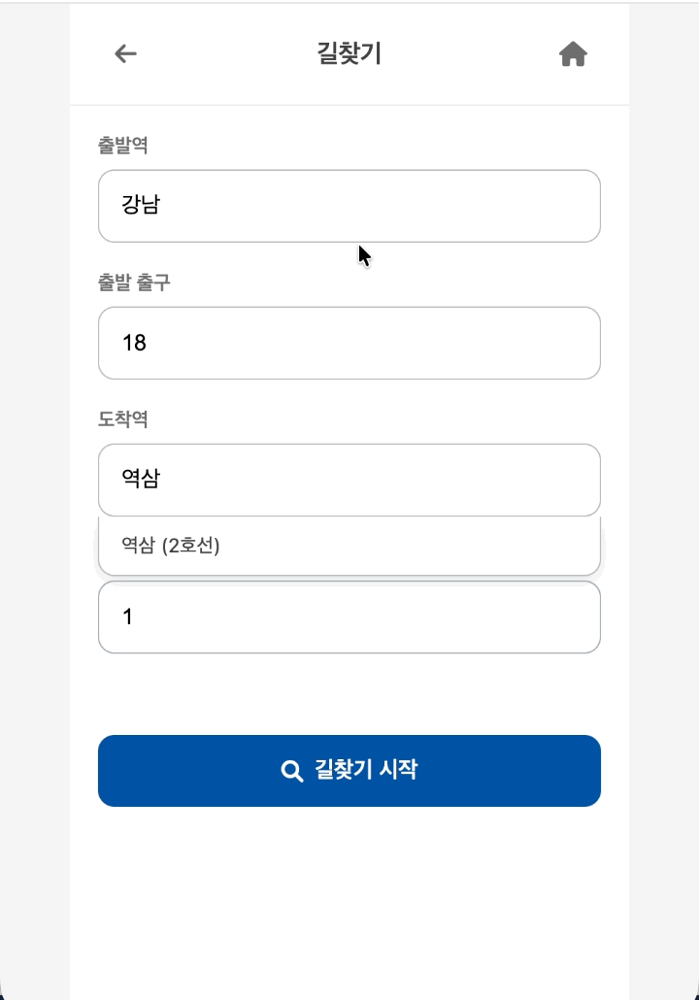
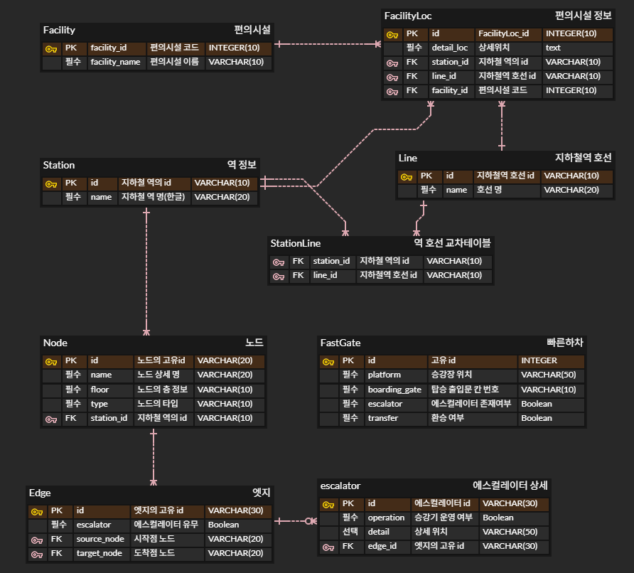
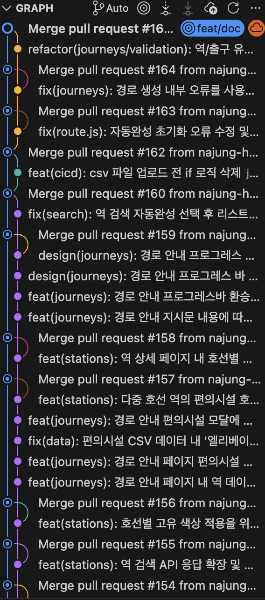

# PROJECT_wisheasy
> 지하철 역사 내 **에스컬레이터 기반 경로 안내 서비스**

  

 

## 1. 프로젝트 개요 

**WISHEASY**는 지하철 역 내부 구조와 에스컬레이터 위치 정보를 기반으로,  
이용 가능한 에스컬레이터를 최대한 활용하는 **역사 내 길찾기 서비스**입니다.

계단보다 에스컬레이터를 선호하는  
- 캐리어 이용객  
- 노약자·어린이 동반 승객  
- 무거운 짐을 든 직장인  

등을 위해, 출발 지점부터 최종 출구까지의 동선을 **스토리 카드 형식**으로 단계별 안내합니다.

- **개발 기간**: 09.12 ~ 12.01 (약 3개월)
- **구성 인원**: 6명 (Advisor 1, PM/Infra 1, FE 1, BE 1, BE/DB 1, DB 1)
- **주요 키워드**: `지하철 역사 내 경로 안내`, `에스컬레이터 최적 활용`, `그래프 기반 길찾기`, `Django & DRF`, `Docker & Nginx & AWS`

---

## 2. 문제 인식 & 서비스 목표

### 😣 Problem

- 지하철 역 내부 구조는 **복잡**하고,  
  에스컬레이터 위치는 실제 동선에서 **직접 눈으로 확인하기 전까지 알기 어렵습니다.**
- 특히 **계단 이용이 어려운 승객**에게는, 잘못된 선택 한 번이 큰 부담이 됩니다.

### 🎯 Goal

> 계단 대신 에스컬레이터를 최대한 활용하면서도, 길을 잃지 않는 역사 내 이동 경험을 만드는 것

- **운영 중인 에스컬레이터 정보**를 기반으로 이용 가능한 동선만을 모아 **그래프 형태로 모델링**하고,
- 에스컬레이터를 적극 활용하는 **우선순위 경로 탐색 알고리즘**으로
- 누구나 따라갈 수 있는 **카드 형식 안내**를 제공합니다.

---
## 3. 핵심 기능 (Key Features)

---

### 3-1. 로그인 & 마이페이지

<table>
  <tr>
    <td align="center" width="50%">
      <strong>로그인 및 환영 메시지</strong> 
      
    </td>
    <td align="center" width="50%">
      <strong>마이페이지</strong> 
      
    </td>
  </tr>
</table>

- OAuth 기반 로그인으로 이용자를 식별하고, 이후 즐겨찾기 등의 기능 확장을 계획 중

---

### 3-2. 에스컬레이터 기반 길찾기

<table>
  <tr>
    <td align="center" width="50%">
      <strong>경로 검색</strong> 
      
    </td>
    <td align="center" width="50%">
      <strong>카드형 이동 안내</strong> 
      
    </td>
  </tr>
</table>

- 출발역·도착역 입력 후, 역사 내 구조와 에스컬레이터 정보를 반영한 동선을 자동 생성
- 각 단계별 이동을 카드 형태로 제공

---

### 3-3. 역사 및 편의시설 정보

<table>
  <tr>
    <td align="center" width="50%">
      <strong>역사 기본 정보 및 노선 정보 조회</strong> 
      
    </td>
    <td align="center" width="50%">
      <strong>편의시설 상세 정보</strong> 
      
    </td>
  </tr>
</table>

- ATM, 물품보관함, 화장실, 엘리베이터, 유실물 보관소, 에스컬레이터 편의시설 정보를  
  경로 안내 페이지에서 바로 확인 가능

---

### 3-4. 사용자 입력 검증 & 예외 처리

<table>
  <tr>
    <td align="center" width="50%">
      <strong>존재하지 않는 역 이름 입력 시 안내</strong> 
      
    </td>
    <td align="center" width="50%">
      <strong>유효하지 않은 출구 선택 시 안내</strong> 
      
    </td>
  </tr>
</table>

- 잘못된 역명·출구 입력에 대한 친절한 에러 메시지 제공
- 역사 내 동선이 존재하지 않는 경우, 대체 안내 및 재입력을 유도

---
## 4. 시스템 구성 (Architecture)

### 4-1. ERD

- 지하철 역, 출구, 층, 에스컬레이터, 편의시설 등을 **정규화된 테이블**로 설계
- 역사 내 시설 간 연결 관계를 그래프 구조로 변환하여 **경로 탐색에 활용**

### 4-2. Graph Modeling & Routing

- Python & `NetworkX` 기반 그래프 모델링
- 노드: 계단/에스컬레이터/승강장/통로/출구 등 역사 내 이동 포인트
- 엣지: 실제 이동 가능한 동선 + 가중치(거리, 층수, 에스컬레이터 우선도 등)
- **에스컬레이터를 우선하는 커스텀 가중치 전략**으로 최적 경로 산출

---
## 5. 기술 스택 (Tech Stack)

### 5-1. 기획 및 협업

  
  
  

---

### 5-2. FE & BE

  <!-- FE -->
  
  
  
  

  <!-- BE -->
  
  
  

---

### 5-3. Data Engineering & Graph Modeling

  
  
  

---

### 5-4. DB

  
  

---

### 5-5. CI/CD 및 배포

  
  
  

  
  

  
  

  
  

  

---

## 6. 협업 방식 (Git Workflow)

- GitHub Flow 기반 브랜치 전략 사용  
- feature 브랜치 → Pull Request → 코드 리뷰 → dev → 배포
- 배포를 GitHub Actions로 자동화

  

---

  

# 팀원소개
<table>
  <tr>
    <td align="center" width="200px">
      
    </td>
    <td align="center" width="200px">
      
    </td>
    <td align="center" width="200px">
      
    </td>
  </tr>
  <tr>
    <td align="center">
      
       
      <b>강한결</b>   (Advisor)
    </td>
    <td align="center">
      
       
      <b>나정현</b>   (PM, Infra CI/CD)
    </td>
    <td align="center">
      
       
      <b>박준아</b>   (UI/UX, Frontend)
    </td>
  </tr>
</table>
<table>
  <tr>
    <td align="center" width="200">
      
    </td>
    <td align="center" width="200">
      
    </td>
    <td align="center" width="200">
      
    </td>
  </tr>
  <tr>
    <td align="center" width="200">
      
       
      <b>김소희</b>   (Backend)
    </td>
    <td align="center" width="200">
      
       
      <b>정환승</b>   (Backend, DB)
    </td>
    <td align="center" width="200">
      
       
      <b>박지연</b>   (DB)
    </td>
  </tr>
</table>

 
 
 

| 전문가 제도 | git 브랜치 전략 | commit 컨벤션 |
| :-----------: | :-----------: | :-----------: |
| [바로가기](./doc/전문가제도.md) | [바로가기](./doc/git_branch_strategy.md) | [바로가기](./doc/commit_message_convention.md) |

