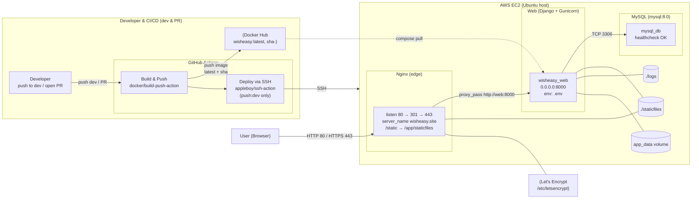
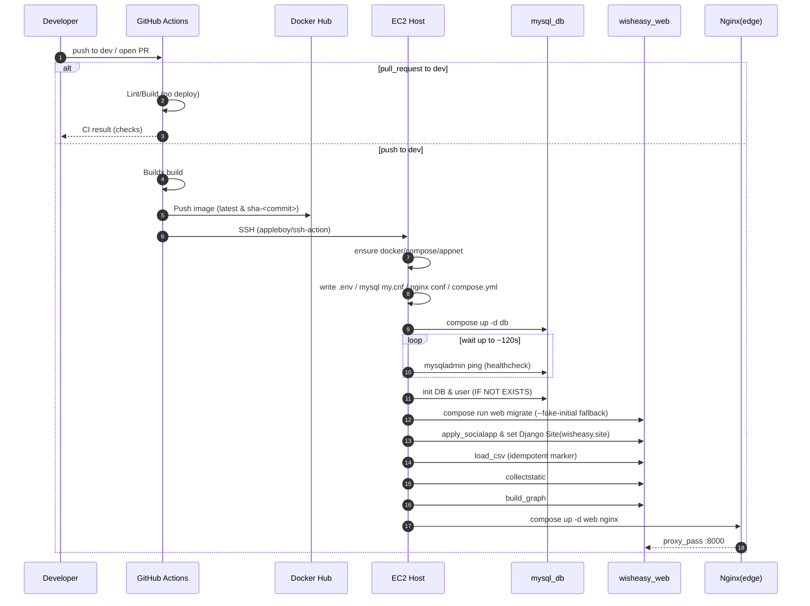

# PROJECT_wisheasy

#  

# 지하철 역사 내 에스컬레이터 기반 경로 안내 서비스

## 서비스 소개
본 서비스는 **지하철 역사 내 이동 경로를 스토리 카드 형식으로 안내**하는 시스템입니다.  
사용자가 출발역과 도착역을 입력하면, 해당 역사에 운영 중인 **에스컬레이터 위치와 역 구조 정보**를 바탕으로  
에스컬레이터 최적의 이동 동선을 단계별로 제공합니다.  

특히 초행길 이용자도 직관적으로 따라갈 수 있도록 스토리 카드 형식의 안내를 제공하여  
**더 쉽고, 더 편안한 지하철 경험**을 보장합니다.

---

## 핵심 가치
- 🚇 **에스컬레이터 최적 활용**  
  역사 내 운영 중인 에스컬레이터 정보를 반영하여, 이용 가능한 에스컬레이터를 놓치지 않도록 안내합니다.

- 🗺️ **역사 내 상세 경로 제공**  
  단순한 출발-도착 정보가 아닌, 역사 내부 이동 경로까지 고려한 단계별 안내를 제공합니다.

- 🏪 **편의시설 정보 제공**  
  화장실, 환승 통로, 편의점 등 역사 내 편의시설 정보를 함께 제공하여 이용 편의를 높입니다.

- 📱 **스토리 카드 형식 안내**  
  단계별 동선 안내를 카드 형식으로 제공하여 직관적이고 쉽게 따라갈 수 있습니다.

---

## 기대 효과
- 초행길 이용자도 길을 잃지 않고 **편리하게 역사 내 이동 가능**
- 노약자, 어린이 동반, 캐리어 이용객 등 **이동 약자의 접근성 개선**
- 단순한 길 안내를 넘어, **쾌적하고 편안한 지하철 경험** 제공

---

## 사용 예시
1. 출발역과 도착역 입력  
2. 에스컬레이터 위치 및 역사 구조 기반 경로 생성  
3. 스토리 카드 형식으로 단계별 안내 제공  

  

# 팀원소개
<table>
  <tr>
    <td align="center" width="200px">
      
    </td>
    <td align="center" width="200px">
      
    </td>
  </tr>
  <tr>
    <td align="center">
      
       
      <b>나정현</b>   (PM, Infra CI/CD)
    </td>
    <td align="center">
      
       
      <b>박준아</b>   (UI/UX, Frontend)
    </td>
  </tr>
</table>
<table>
  <tr>
    <td align="center" width="200">
      
    </td>
    <td align="center" width="200">
      
    </td>
    <td align="center" width="200">
      
    </td>
  </tr>
  <tr>
    <td align="center" width="200">
      
       
      <b>팀원1</b>   (Backend)
    </td>
    <td align="center" width="200">
      
       
      <b>팀원2</b>   (Frontend)
    </td>
    <td align="center" width="200">
      
       
      <b>팀원3</b>   (Infra)
    </td>
  </tr>
</table>

### 1) 아키텍처 개요 (Flowchart)

 

###     2) 배포 파이프라인(Sequence)

 

