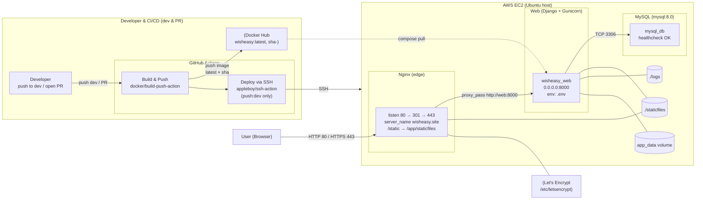
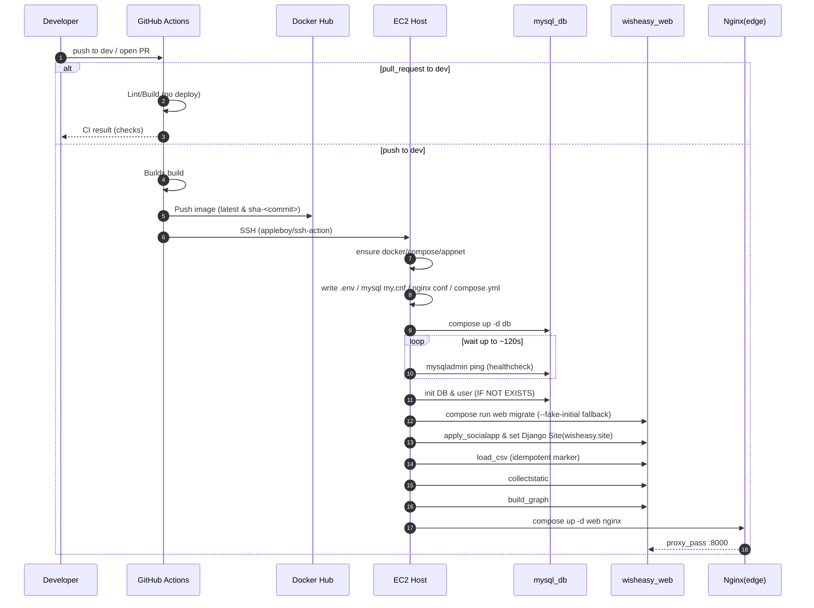

### 1) 인프라 아키텍처 (Flowchart)

 

```mermaid
flowchart LR
  %% ===== Clusters =====
  subgraph Dev["Developer & CI/CD (dev & PR)"]
    A[Developer<br/>push to dev / open PR]
    subgraph GHA["GitHub Actions"]
      B[Build & Push<br/>docker/build-push-action]
      D["Deploy via SSH<br/>appleboy/ssh-action<br/>(push:dev only)"]
    end
    HUB["(Docker Hub<br/>wisheasy:latest, sha-<commit>)"]
  end

  subgraph EC2["AWS EC2 (Ubuntu host)"]
    subgraph DB["MySQL (mysql:8.0)"]
      M1["mysql_db<br/>healthcheck OK"]
    end
    subgraph WEB["Web (Django + Gunicorn)"]
      W1["wisheasy_web<br/>0.0.0.0:8000<br/>env: .env"]
    end
    subgraph EDGE["Nginx (edge)"]
      N1["listen 80 → 301 → 443<br/>server_name wisheasy.site<br/>/static → /app/staticfiles"]
    end
    SF[(./staticfiles)]
    LG[(./logs)]
    VD[(app_data volume)]
  end

  EXT["(Let's Encrypt<br/>/etc/letsencrypt)"]
  U["User (Browser)"]

  %% ===== Flows =====
  A -->|push dev / PR| B
  B -->|push image<br/>latest + sha| HUB
  B --> D
  D -->|SSH| EC2
  HUB -. compose pull .-> W1

  %% Inbound traffic
  U -->|"HTTP 80 / HTTPS 443"| N1
  N1 -->|proxy_pass http://web:8000| W1
  W1 -->|TCP 3306| M1

  %% Volumes / mounts
  N1 --- SF
  W1 --- SF
  W1 --- LG
  W1 --- VD
  N1 --- EXT

  %% Notes
  classDef note fill:#fff,stroke:#bbb,stroke-dasharray:3 3,color:#333;
```

###     2) 배포 파이프라인(Sequence)

 

```mermaid
sequenceDiagram
  autonumber
  participant Dev as Developer
  participant GHA as GitHub Actions
  participant Hub as Docker Hub
  participant EC2 as EC2 Host
  participant DB as mysql_db
  participant Web as wisheasy_web
  participant Nginx as Nginx(edge)

  Dev->>GHA: push to dev / open PR
  alt pull_request to dev
    GHA->>GHA: Lint/Build (no deploy)
    GHA-->>Dev: CI result (checks)
  else push to dev
    GHA->>GHA: Buildx build
    GHA->>Hub: Push image (latest & sha-<commit>)
    GHA->>EC2: SSH (appleboy/ssh-action)

    EC2->>EC2: ensure docker/compose/appnet
    EC2->>EC2: write .env / mysql my.cnf / nginx conf / compose.yml
    EC2->>DB: compose up -d db
    loop wait up to ~120s
      EC2->>DB: mysqladmin ping (healthcheck)
    end
    EC2->>DB: init DB & user (IF NOT EXISTS)

    EC2->>Web: compose run web migrate (--fake-initial fallback)
    EC2->>Web: apply_socialapp & set Django Site(wisheasy.site)
    EC2->>Web: load_csv (idempotent marker)
    EC2->>Web: collectstatic
    EC2->>Web: build_graph

    EC2->>Nginx: compose up -d web nginx
    Nginx-->>Web: proxy_pass :8000
  end
```

