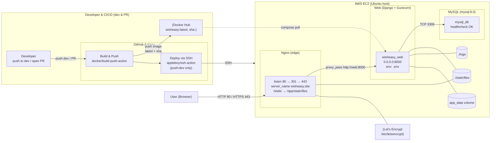
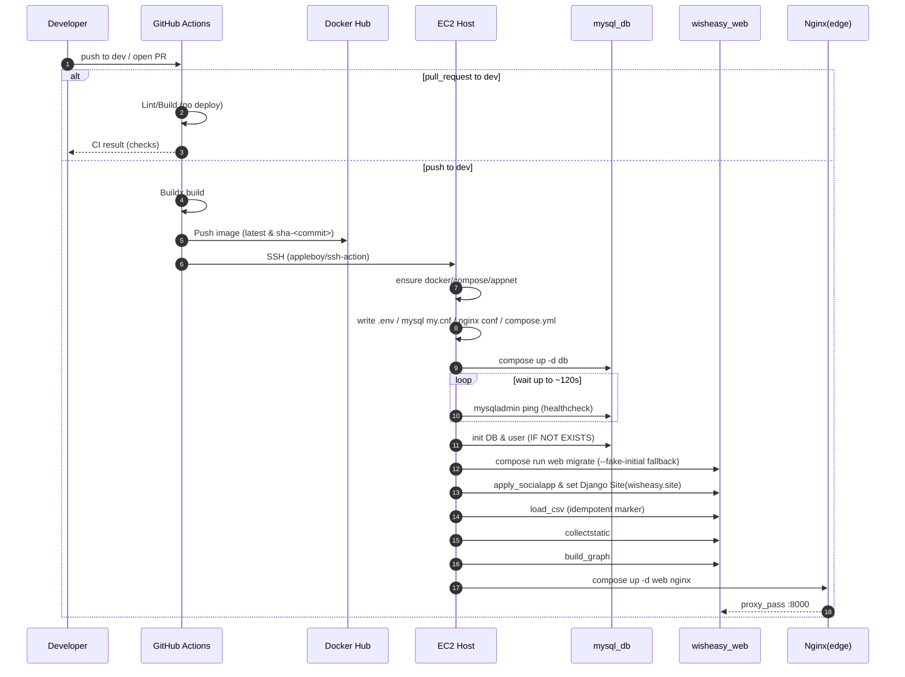

# 정현 |  PM · Infra expert

 

### 핵심 가치 : 

**안정성 · 보안 · 가시성** 

### 목표 : 

**개발 환경과 운영 환경의 분리** · **CI/CD** 자동화 · 그리고 **제한된 서버 자원(EC2)**에서의 안정성 확보 

### 기술 스택 : 

`Django` 기반 웹 서비스를 `AWS EC2 t3.micro`의 제한된 자원 환경에서 `Docker` 기반의 격리된 서비스를 구축하였으며,

`GitHub Actions`를 통해 자동화 파이프라인을 운영하여 `wisheasy.site` 에 배포하였습니다.

 

## 사용한 기술 스택

 

### CI/CD 및 배포

  
  
  

  
  

  
  

   
  
  

  
 

### 기획 및 협업

  
  
  
  

 

### 1) 인프라 아키텍처 (Flowchart)

 

이 프로젝트는 개발 편의성과 운영 안정성을 동시에 확보하기 위해 다음과 같은 아키텍처를 채택했습니다. 

 

### 2) 배포 파이프라인

 

 

 

# 기술적 고난

본 프로젝트에서, 저는 제한된 EC2 환경(t3.micro)에서 Docker Compose 기반의 CI/CD 파이프라인을 구축하고 운영하는 과정에서 발생하는 다양한 기술적 난관들을 체계적인 트러블 슈팅과 설정 최적화를 통해 해결했습니다.

 

## 1. 개발 및 운영 환경 분리와 설정 관리의 복잡성

 

### A. Django Settings 분리 및 적용 오류 해결
 
* **문제 인식:** 초기에는 단일 `settings.py` 파일로 개발과 운영 환경을 함께 관리하여, 로컬 환경에서 HTML/CSS 수정 사항을 즉각적으로 확인하기 어려웠습니다.
* **해결:** `settings.py` 파일을 `base.py`, `prod.py`, `local.py` 세 파일로 분리하여 개발/운영 설정을 명확히 구분하고, 각 환경에 맞게 데이터베이스와 호스트 설정을 재정의했습니다.
* **배포 과정에서의 오류:** 설정 분리 후 배포 시, Gunicorn 프로세스가 올바른 설정을 로드하지 못해 `AttributeError: 'Settings' object has no attribute 'ROOT_URLCONF'` 오류가 발생했습니다. 이는 docker-compose 설정에서 `DJANGO_SETTINGS_MODULE` 환경 변수를 `config.settings.prod`로 명시적으로 지정하여 해결했습니다.

 

 

### B. Google SocialApp 초기화 및 배포 스크립트 디버깅

 
* **문제 인식:** 서버 분리 작업 후, `allauth.socialaccount.models.SocialApp.DoesNotExist` 에러가 발생하며 구글 로그인이 작동하지 않았습니다.
* **해결:** 이는 CI/CD 배포 스크립트에서 SocialApp 및 Site 모델을 초기화하는 Django 명령어에 `--settings=config.settings.prod` 옵션을 누락했기 때문에 발생했으며, 스크립트 수정 후 정상화되었습니다. 또한, 팀원들에게는, 로컬 환경에서 구글 로그인 변수 초기화 및 마이그레이션을 위해 `--settings=config.settings.local` 옵션을 사용하여 명령어를 실행하도록 안내했습니다.

 

 

### C. Django 호스트 설정 오류 (Disallowed Host)
 
* **문제 인식:** EC2 IPV4 주소를 통해 접근 시 `Invalid HTTP_HOST header` 오류가 발생하여 서비스 접근이 차단되었습니다.
* **해결:** EC2의 퍼블릭 IP를 `DJANGO_EC2_HOSTS` 환경 변수로 관리하고, 운영 환경 설정 파일(`prod.py`)의 `ALLOWED_HOSTS` 목록에 해당 IP 주소를 추가하여 해결했습니다.

 

 

---

## 2. CI/CD 및 운영 환경 리소스 제약 극복
 
프로젝트는 AWS 프리티어의 한계 때문에 EC2 인스턴스(t3.micro)를 사용했습니다. 이 때문에, 메모리 및 디스크 용량 부족 문제가 빈번하게 발생했고, 이를 해결하기 위한 최적화 작업을 진행했습니다.
 

### A. 메모리 부족(OOM)으로 인한 배포 실패 및 스왑 설정
- **문제 인식:** Docker Hub로부터 이미지를 가져오거나 DB 마이그레이션 도중 RAM 사용량이 99%에 도달하며 컨테이너가 강제 종료되는 exit code 137 (OOM) 오류 및 타임아웃 문제가 발생했습니다.
- **해결 (하드웨어 보완):** 부족한 RAM 용량을 보완하기 위해 EC2 인스턴스에 스왑(Swap) 메모리를 2GB, 추후 4GB까지 설정하여 메모리 부족 상황에 대비했습니다.

 

 

### B. MySQL 메모리 경량화 자동화
 
- **문제 인식:** 스왑 메모리 확장에도 불구하고 마이그레이션 단계에서 OOM이 재발함에 따라, MySQL 자체의 메모리 사용량을 줄이는 방향으로 접근했습니다.
- **해결 (소프트웨어 최적화):** CI/CD 파이프라인에 MySQL 설정 파일(`my.cnf`) 자동 생성 로직을 추가하여 메모리 사용량을 최소화했습니다. 주요 경량화 설정 내용은 다음과 같습니다:
  * `innodb_buffer_pool_size`를 64MB로 대폭 축소.
  * `max_connections`를 50으로 제한.
  * `tmp_table_size`, `sort_buffer_size`, `join_buffer_size` 등의 버퍼 크기를 1MB 또는 16MB 수준으로 제한하여 쿼리당 메모리 할당량을 관리했습니다.

  

### C. 도커 디스크 용량 포화 문제 해결

- **문제 인식:** EC2 루트 디스크가 99% 포화되어 MySQL 접속 오류(`ERROR 1045: Access denied`)가 발생하는 등 시스템 전반의 동작이 불가능해졌습니다.
- **해결 (수동):** `docker system prune -a --volumes` 명령을 통해 불필요한 Docker 이미지, 컨테이너, 볼륨 등 디스크 자원을 정리하여 디스크 사용률을 99%에서 약 60%로 낮췄습니다.
- **해결 (자동화):** 이 문제를 예방하기 위해 CI/CD 워크플로우에 오래된 Docker 이미지 자동 정리 Job을 추가했습니다. 이 Job은 배포 완료 후 실행되며, 최근 3개의 SHA 태그 이미지만 보존하고 나머지 이미지를 강제 삭제하도록 스크립트를 구현했습니다.

 

 

---

## 3. 배포 아키텍처 안정화 및 디버깅 기법 도입
 
### A. Docker 포트 충돌 및 Nginx 재기동 이슈

- **문제 인식:** 배포 초기 과정에서 `port is already allocated` 오류가 자주 발생하였는데, 이는 웹 컨테이너가 호스트의 80번 포트를 직접 바인딩하려 했기 때문이었습니다. 또한, 메모리 부하로 인해 Nginx 컨테이너가 불완전하게 실행되어 80/443 포트 점유에 실패하는 문제도 있었습니다.
- **해결:** 웹 컨테이너는 `expose: "8000"`을 사용하여 내부 네트워크에만 노출하고, Nginx 컨테이너만 `ports: "80:80", "443:443"`으로 외부 포트를 매핑하도록 Docker Compose 설정을 수정했습니다. Nginx 컨테이너의 불안정 문제(불완전 실행)는 EC2 인스턴스 자체를 재부팅하여 안정적인 초기 서버 구축 상태를 확보함으로써 해결되었습니다.

 

### B. 로깅 시스템 구축

- **문제 인식:** 서버 에러 발생 시 로그가 제대로 남지 않아 문제 추적이 어려웠습니다.
- **해결:** Django 설정에 상세 로깅 시스템을 도입했습니다. 로그 포맷을 verbose로 통일하고, 콘솔 출력(`logging.StreamHandler`)과 파일 로테이션(`TimedRotatingFileHandler`)을 병행하여 로그를 기록했습니다. 또한, Gunicorn 프로세스가 띄워주는 로그를 관찰하기 위해 접근 로그(`--access-logfile`)와 에러 로그(`--error-logfile`)를 지정하고, 초기 디버깅을 위해 로그 레벨을 debug로 설정했습니다. 추후 운영 환경에서는 로그를 info 레벨로 바꾸어 운영 효율성을 도모하였습니다.

 

 

## 4. 인프라 의존성 문제 (벤더 종속성)

- **문제 인식:** CI/CD를 통한 배포 중, 외부 인프라(도커허브)의 장애로 인해 이미지를 가져올 수 없어 배포가 완전히 실패하는 상황이 발생했습니다. 이로 인해 코드 오류가 아님에도 불구하고 벤더(도커 허브)에 대한 높은 종속성의 위험성을 실감했습니다.
- **대응 및 교훈:** 도커허브 장애에 대비하여 AWS ECR등 대체 레지스트리를 병행하거나 메인 레지스트리로 전환하는 방안을 고려하게 되었으며, 배포 자동화를 위해서는 기반 인프라에 대한 견고한 이해와 외부 종속성을 줄이는 거시적인 아키텍처 설계가 중요함을 깨달았습니다!
---
 

# 소감
저는 첫 번째 프로젝트를 이렇게 훌륭한 팀원들과 고문님과 함께 할 수 있어 정말 영광이었습니다. 개인적으로는 이번 경험이 DevOps에 깊은 관심을 갖게 된 결정적인 계기가 되었고, PM 역할을 수행하는 데 필요한 자질과 제가 가진 강점을 스스로 확인할 수 있는 기회였던 것 같습니다.

항상 어렵고 머리 아프게 고민한 만큼 성장한다고 믿는데, 이번 프로젝트는 정말 배운 것도, 얻어 가는 것도 많았습니다.

우리 팀원 모두에게 이 프로젝트가 개발자 인생의 성공적인 출발점으로 기억되었으면 하는 마음입니다. 모두 고생 많으셨습니다!!!!!